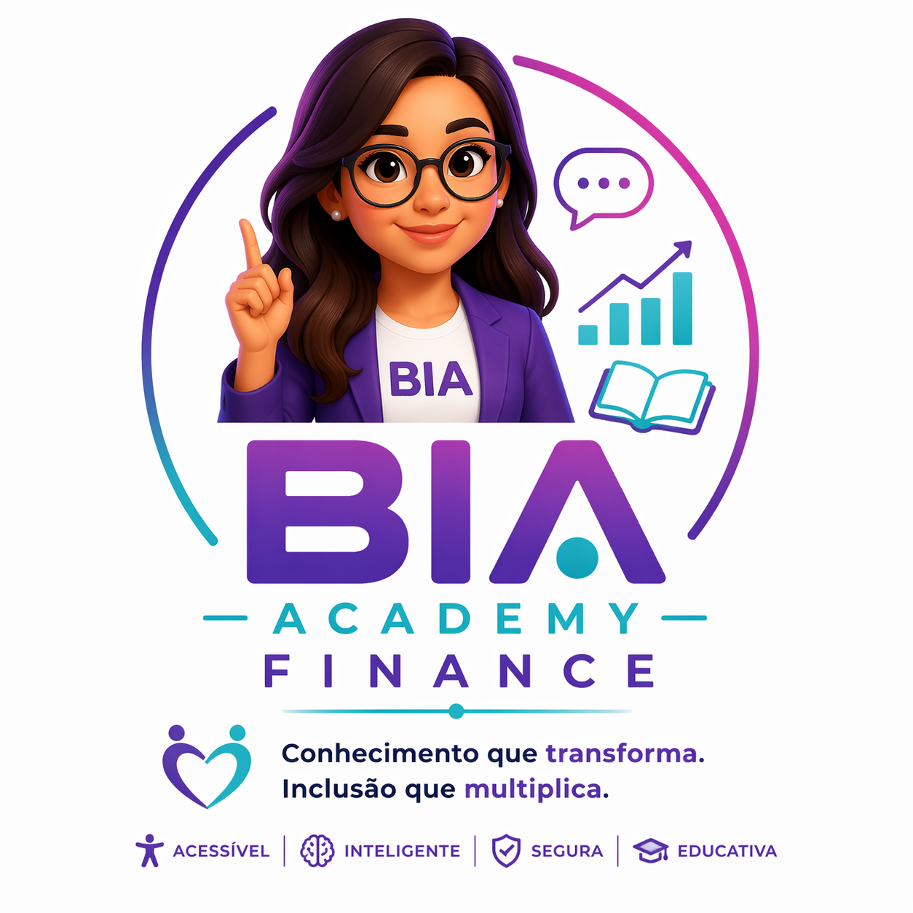

# 💡 BIA Academy Finance

<p align="center">
  
</p>

<p align="center">
  <b>🚀 Educadora Financeira Inclusiva com IA Local</b><br>
  <i>Transformando educação financeira em uma experiência acessível, segura e inteligente</i>
</p>

---

<p align="center">


</p>

---

## 🎥 Demonstração

<p align="center">
  
</p>

🎧 **Ouça uma resposta da BIA (acessibilidade):**  
👉 https://BARBARANFS.github.io/bia-academy-finance/

---

## 📌 Visão Geral

A **BIA Academy Finance** é uma aplicação de Inteligência Artificial focada em **educação financeira inclusiva**, baseada no **Miniguia do Sistema Financeiro Nacional (SFN)** e em um **Glossário de Conceitos**, ambos desenvolvidos previamente pela autora e utilizados como base de dados para o desenvolvimento deste projeto, garantindo consistência, qualidade e confiabilidade das respostas.

💡 Diferenciais:

- 🧠 IA **100% local (offline)**  
- 📚 Base de conhecimento própria (`data/`)  
- 🔎 Sistema **RAG (busca contextual inteligente)**  
- 🔐 Controle total das respostas  
- 🔊 Suporte a áudio (acessibilidade)

---

## ❌ O Problema

A educação financeira ainda é inacessível para muitas pessoas:

- Linguagem técnica complexa  
- Falta de inclusão  
- Pouca personalização  
- Dificuldade para iniciantes  

---

## ✅ A Solução

A BIA atua como uma **mentora financeira inteligente e inclusiva**, oferecendo:

- 💬 Chat educativo com linguagem simples  
- 🧠 Quizzes com aprendizado ativo  
- 🎮 Jogos com metáforas financeiras  
- 🎯 Personalização por perfil  
- 🔊 Respostas em áudio  
- 🛡️ Segurança (sem recomendações financeiras)  

---

## 👥 Público-Alvo

- 👩‍🎓 Iniciantes em investimentos  
- 👴 Idosos  
- 👁️ Pessoas com deficiência visual  
- 👐 Pessoas com deficiência auditiva  
- 🧩 Pessoas neurodivergentes  

---

## 🧠 Funcionalidades

### 💬 Chat Educacional
- Respostas baseadas em documentos locais  
- Uso de RAG para contextualização  
- Linguagem adaptada ao usuário  

---

### 🔊 Acessibilidade

- 👁️ Deficiência visual → áudio automático (gTTS)  
- 🧠 Neurodivergentes → respostas estruturadas  
- 👴 Idosos → linguagem simplificada  
- 👐 Deficiência auditiva → texto claro  

---

### 🧠 Quiz Interativo
- Perguntas com feedback educativo  
- Sistema de pontuação  

---

### 🎮 Jogos Inclusivos
- Narrativas interativas  
- Metáforas financeiras  

---

### 🏆 Gamificação
- Pontuação  
- Níveis (Iniciante → Intermediário → Avançado)  

---

## 🏗️ Arquitetura

```
bia-academy-finance/
│
├── assets/
├── data/
├── docs/               # GitHub Pages (demo de áudio)
│
├── src/
│   ├── app.py
│   ├── meu_rag.py
│
├── requirements/
│   └── requirements.txt
│
└── README.md
```

---

## 🧩 Stack Tecnológica

| Tecnologia | Uso |
|----------|-----|
| Python | Backend |
| Streamlit | Interface |
| Ollama | IA local |
| Sentence Transformers | Embeddings |
| gTTS | Áudio |
| Pandas / NumPy | Dados |

---

## 🧠 Como a IA Funciona

### 🔹 RAG (Retrieval-Augmented Generation)

```
Pergunta → Busca em data/ → Contexto → IA → Resposta
```

---

## 🔐 Segurança

- ❌ Não recomenda investimentos  
- ❌ Não usa APIs externas  
- ❌ Não coleta dados  
- ✅ Base local controlada  

---

## ⚙️ Como Rodar

```bash
git clone https://github.com/BARBARANFS/bia-academy-finance.git

cd bia-academy-finance

pip install -r requirements/requirements.txt

ollama serve

streamlit run src/app.py
```

---

## 🎧 Demo de Áudio

Experimente uma resposta real da BIA:

👉 https://BARBARANFS.github.io/bia-academy-finance/

---

## 📊 Diferenciais

✨ 100% offline  
✨ IA local (sem custo)  
✨ Inclusividade real  
✨ Suporte a áudio  
✨ Experiência gamificada  

---

## 🚀 Roadmap

### Curto Prazo
- [x] Chat com RAG  
- [x] Base estruturada  
- [x] Áudio integrado  

### Médio Prazo
- [ ] Melhorias de UX  
- [ ] Validação anti-alucinação  

### Longo Prazo
- [ ] Assistente por voz completo  
- [ ] Versão mobile  
- [ ] API da BIA  

---

## 👩‍💻 Autora

**Barbara Freitas**  

🎓 Bootcamp Bradesco - DIO  
🤖 IA Generativa & Dados  

---

## 📜 Licença

MIT License  

---

## 💬 Mensagem Final

> “Educação financeira não deve ser um privilégio —  
> deve ser acessível, inclusiva e inteligente.”
