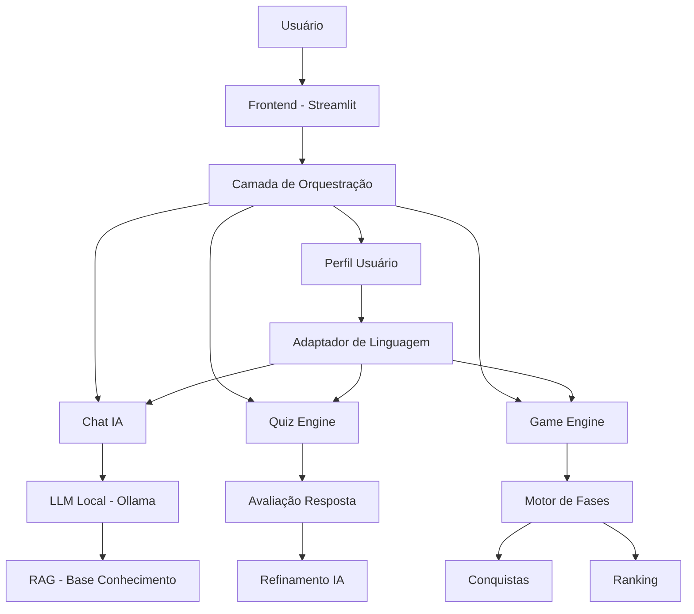

# 🚀 BIA Academy Finance — Documentação do Agente

---

# 1. Visão Geral

## 📌 Descrição

A **BIA Academy Finance** é uma plataforma educacional inteligente que utiliza **IA, gamificação e acessibilidade adaptativa** para ensinar educação financeira de forma personalizada, progressiva e inclusiva.

---

## 🎯 Proposta de Valor

> Transformar aprendizado financeiro em uma experiência **interativa, acessível e orientada por IA**, sem expor o usuário a riscos ou recomendações indevidas.

---

## 🧠 Diferencial Competitivo

* IA contextual com **RAG local (baixo custo)**
* **Gamificação real** (não superficial)
* Inclusão nativa (não como “feature extra”)
* Aprendizado baseado em **decisão + erro + reforço**

---

# 2. Problema de Mercado

## 🔴 Dores do usuário

* Não entende termos financeiros
* Medo de investir
* Conteúdo técnico e inacessível
* Falta de personalização
* Baixa retenção em educação financeira

---

## 💡 Oportunidade

Crescimento de:

* Open Banking
* Educação financeira obrigatória
* Plataformas edtech
* Inclusão digital

---

# 3. Solução

A BIA atua como:

> 🧠 **Mentora Financeira Inteligente + Sistema Educacional Gamificado**

---

## 🔧 Como resolve

* Explica conceitos com IA contextual
* Avalia respostas do usuário
* Corrige e melhora explicações automaticamente
* Evolui o usuário por fases
* Adapta comunicação por perfil

---

# 4. Arquitetura do Sistema



---

# 5. Arquitetura Técnica (Detalhada)

## 🧱 Camadas

### 1. Interface (Frontend)

* Streamlit
* Componentes:

  * Chat
  * Quiz
  * Jogo
  * HUD (pontuação, nível)

---

### 2. Orquestração

Responsável por:

* Gerenciar estado (`session_state`)
* Direcionar fluxo (chat, quiz, jogo)
* Aplicar regras de negócio

---

### 3. IA (Core)

#### LLM Local

* Modelos via **Ollama**
* Exemplos:

  * phi3
  * gemma

#### RAG

* Busca contexto em:

  * JSON
  * documentos locais

---

### 4. Motores

#### 🧠 Quiz Engine

* Avaliação de resposta
* Geração de explicação
* Melhoria automática

#### 🎮 Game Engine

* Sistema de fases
* Dificuldade adaptativa
* Progressão

---

### 5. Sistema de Progressão

* Pontuação global
* Nível
* Conquistas
* Ranking

---

# 6. Modelo de Dados

## 📦 Estrutura Atual

### Quiz

* pergunta
* opcoes
* resposta_correta

---

### Jogo

* fases (hardcoded)
* pontos
* progressão

---

## 🚀 Estrutura Enterprise (recomendada)

### Usuário

```json
{
  "id": "user_001",
  "publico": "iniciante",
  "pontuacao": 120,
  "nivel": "Avançado",
  "historico_respostas": []
}
```

---

### Progresso

```json
{
  "fase_atual": 2,
  "conquistas": ["Primeira conquista"],
  "ranking_score": 120
}
```

---

# 7. Inteligência do Sistema

## 🧠 Pipeline de Resposta

1. Usuário responde
2. IA gera explicação
3. Sistema avalia qualidade
4. Se necessário → simplifica
5. Adapta ao público
6. Entrega resposta final

---

## 🔍 Avaliação Automática

Critérios:

* Clareza
* Assertividade
* Acessibilidade

---

# 8. Gamificação (Core do Produto)

## 🎮 Elementos

* Pontuação
* Nível
* Fases
* Conquistas
* Ranking

---

## 🔁 Loop de Engajamento

1. Usuário responde
2. Recebe feedback
3. Ganha pontos
4. Evolui nível
5. Desbloqueia fases
6. Continua aprendendo

---

# 9. Acessibilidade (Diferencial Estratégico)

## ♿ Adaptação Dinâmica

Baseado em:

* público selecionado

---

## 🎯 Estratégias

* Simplificação textual
* Estrutura por tópicos
* Metáforas
* Narrativas
* Clareza progressiva

---

# 10. Segurança e Compliance

## 🔒 Diretrizes

* Não recomenda investimentos
* Não acessa dados sensíveis
* Não faz promessas financeiras

---

## 🛡 Anti-alucinação

* Uso de RAG
* Limitação de contexto
* Mensagens de fallback

---

# 11. Métricas de Produto (KPIs)

## 📊 Engajamento

* Tempo na plataforma
* Nº de perguntas respondidas
* Nº de fases concluídas

---

## 📈 Aprendizado

* Taxa de acerto
* Evolução de nível
* Retenção por sessão

---

## 🎯 Qualidade

* Assertividade da IA
* Feedback do usuário

---

# 12. Roadmap de Evolução

## 🔹 Curto prazo

* JSON dinâmico para jogo
* Persistência de dados

---

## 🔹 Médio prazo

* Login de usuário
* Dashboard de progresso

---

## 🔹 Longo prazo

* App mobile
* API backend
* IA mais robusta

---

# 13. Escalabilidade

## 🚀 Evolução técnica

Atual:

* Local (Streamlit + Ollama)

Futuro:

* Backend (FastAPI)
* Banco de dados
* Deploy cloud

---

## 🌍 Possíveis integrações

* Bancos digitais
* Edtechs
* Plataformas de investimento

---

# 14. Posicionamento de Mercado

## 🧩 Categoria

* EdTech
* FinTech
* AI Learning Platform

---

## 🆚 Concorrência

A BIA se diferencia por:

* IA + Gamificação + Inclusão (os 3 juntos são raros)
* Aprendizado ativo (não só conteúdo passivo)

---

# 15. Pitch 

> A BIA Academy Finance é uma plataforma de educação financeira inteligente que utiliza inteligência artificial, gamificação e acessibilidade para transformar o aprendizado em uma experiência prática, personalizada e inclusiva — preparando usuários para tomar decisões financeiras com segurança, sem expô-los a riscos.

---


